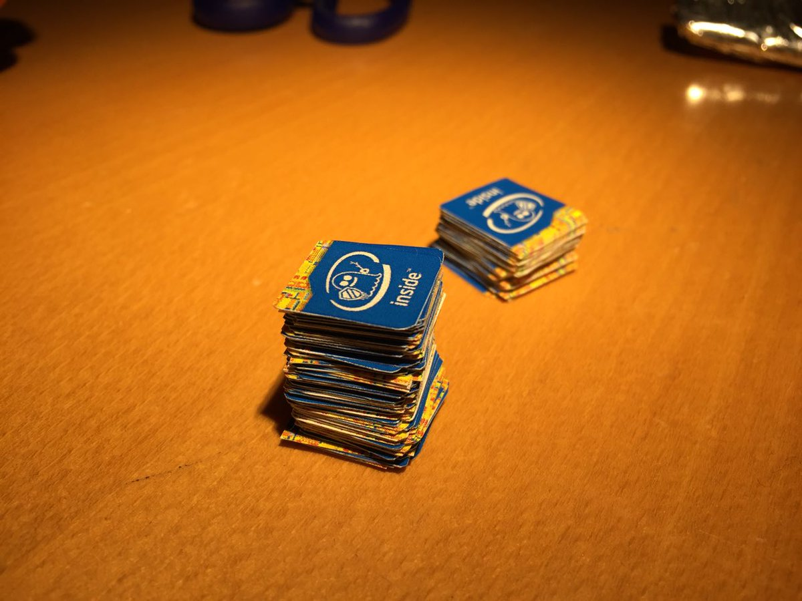

# Meltdown Spectre Inside
Stickers for labeling [meltdown and spectre](https://meltdownattack.com/) affected devices.

Special thanks to [@codeofthedamned](https://twitter.com/codeofthedamned) who designed the stickers
and [@phlnm](https://github.com/phlmn/printsheet) for writing [software to do the panelisation](https://github.com/phlmn/printsheet).

## Get some!
Just go to a local coppyshop and print the `panel_18mm.pdf` onto a sticky sheet of Din A4 paper.
Inkjet print is preffered.

